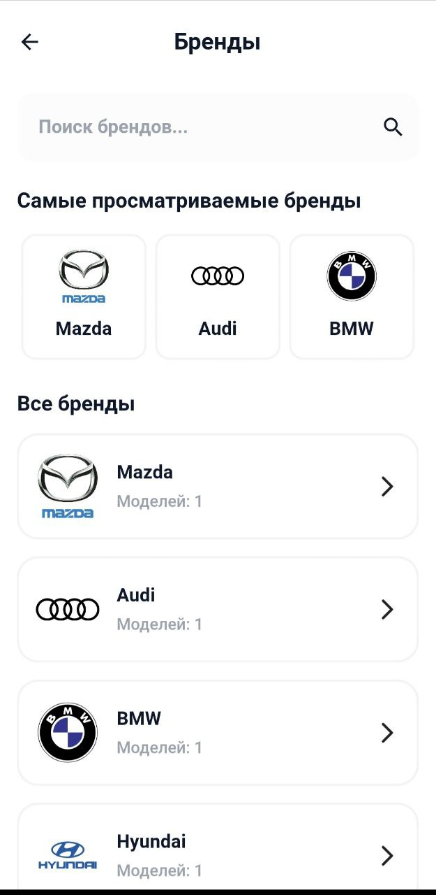
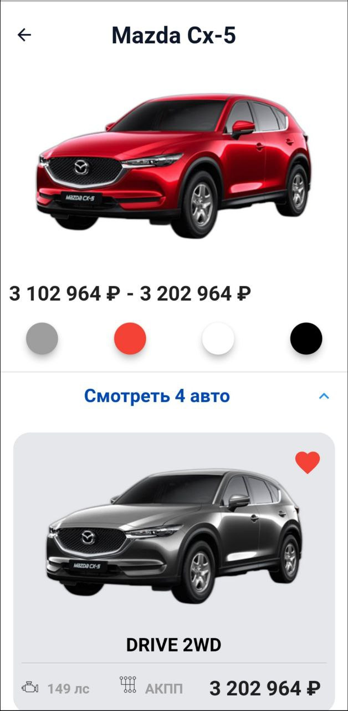
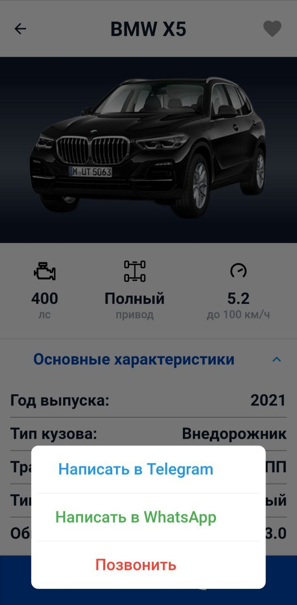
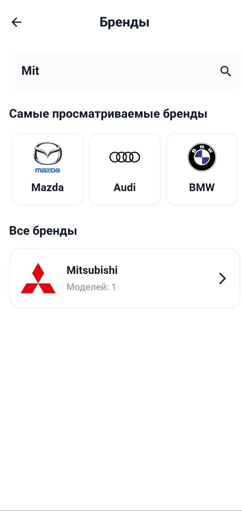

# Car_sale_app
Проект иммитирующий работу с выбором автомобилей для дальнейшей покупки.

## Основной функционал :
 - Поиск брендов 
 - Просмотр общей информации по выбранной модели
 - Просмотр конкретного автомобиля в наличии
 - Автоматический расчет расходов на топливо в зависимости от типа топлива, среднего расхода и тд
 - Добавление понравившихся автомобилей в избранное с возможностью последующего экспорта в PDF
 - Возможность совершить звонок/написать в мессенджере продавцу
 - Возможность сравнить с одноклассниками(автомобилями той же категории)
  
### Основной экран
     
 
### Избранное 

### Просмотр конкретных моделей
 
 
### Страница автомобиля на продажу
 
 
 ### Поиск желаемого бренда
 
